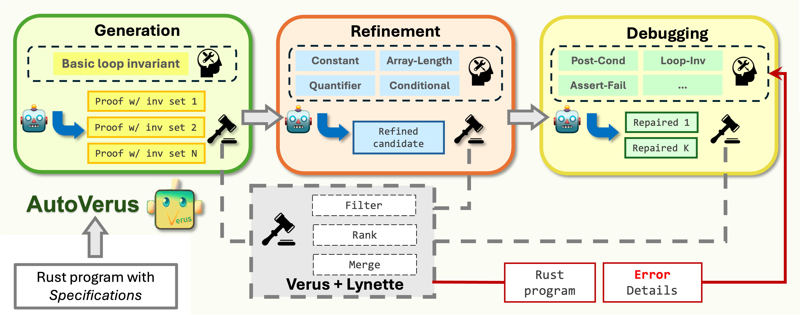

#  Verus Proof Synthesis

<p align="left">
    <a href="https://arxiv.org/abs/2409.13082">
    <a href="https://sites.google.com/view/autoverus">
</p>



This repository contains code for automated Verus proof synthesis.

* `benchmarks`. This folder contains a number of Rust/Verus proof tasks, including all the 150 proof tasks referred to as <i>VerusBench</i> in our tech report. Please refer to the [benchmarks README](benchmarks/README.md) for more details.
* `code`. This folder contains the python code that does proof synthesis for Verus.
* `utils/lynette`. This folder contains a Verus parser that is written to support Verus proof synthesis.

## Pre-requisites

* You need to install [Verus](https://github.com/verus-lang/verus) before using this tool
* You may need to run `cargo install verusfmt` to install the Verus formatter

## Usage

```bash
python main.py --input <input_file> --output <output_file> --config <config_file> 
```
* `--input` specify a rust file that you want to generate Verus proof for (default: input.rs)
* `--output` specify a file that you want the final output to be written in (default: output.rs)
* `--config` specify your configuration. The format of this file is shown in config.json (default: config.json)
* `--repair` specify the number of debugging rounds before giving up (default: 10) 
There are a few other parameters that you can set. Try `python main.py -h' to know more.

In addition to the final output, you will also see a folder prefixed by `intermediate-` that contains all the intermediate files generated by LLM and by our tool.

# Limitations
1. Currently, we only support synthesizing proof for one file that contains one function at a time. Support for multi-file/multi-function is our ongoing work.
2. Sometimes, the code generated by LLM may cause our lynette Verus parser to panic.
3. The output is inherently non-deterministic given the random nature of LLM.

## Further reading

[Our tech-report](https://arxiv.org/abs/2409.13082)

## Contributing

This project welcomes contributions and suggestions. Most contributions require you to agree to a Contributor License Agreement (CLA) declaring that you have the right to, and actually do, grant us the rights to use your contribution. For details, visit https://cla.microsoft.com.

When you submit a pull request, a CLA-bot will automatically determine whether you need to provide a CLA and decorate the PR appropriately (e.g., label, comment). Simply follow the instructions provided by the bot. You will only need to do this once across all repositories using our CLA.

This project has adopted the [Microsoft Open Source Code of Conduct](https://opensource.microsoft.com/codeofconduct/). For more information see the [Code of Conduct FAQ](https://opensource.microsoft.com/codeofconduct/faq/) or contact [opencode@microsoft.com](mailto:opencode@microsoft.com) with any additional questions or comments.

# Trademarks 

This project may contain trademarks or logos for projects, products, or services. Authorized use of Microsoft trademarks or logos is subject to and must follow Microsoft’s Trademark & Brand Guidelines. Use of Microsoft trademarks or logos in modified versions of this project must not cause confusion or imply Microsoft sponsorship. Any use of third-party trademarks or logos are subject to those third-party’s policies.
